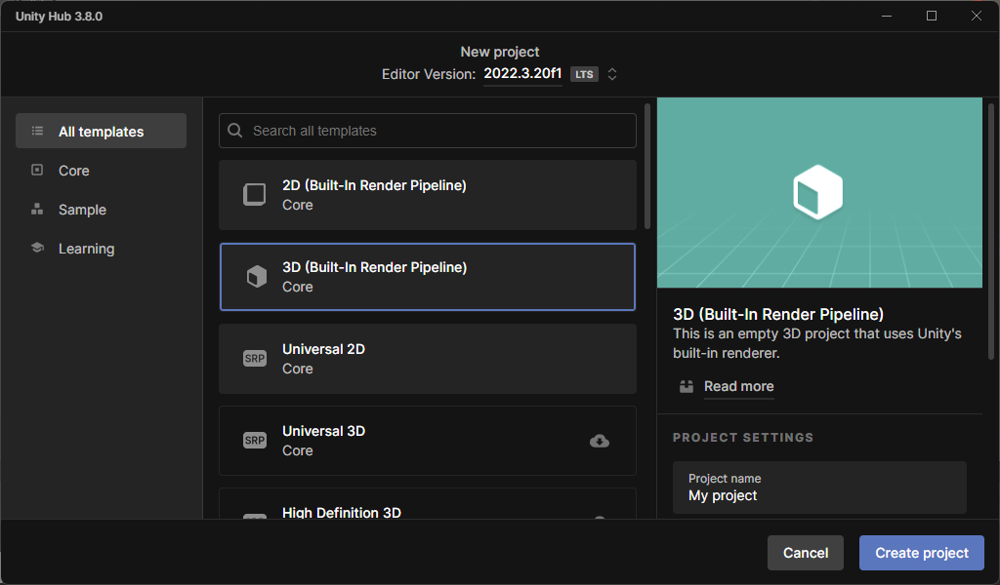

# Description

ControlN7Visuals is a Unity project specifically developed for the sake of 3D-visualizing optimal
control solutions. It offers a premade Unity scene with custom editor inspector: the user selects PNG solution graphs from the Unity editor and they automatically get added onto a sphere. The project can then be built in order to get a visual demonstration web module, for example.

# Setting up

## Open new project

Open Unity Hub and click on "New project" and choose "3D (Built-in Render Pipeline)" template, then click on "Create project".

## Copy repository's folders

Copy files from folders "Assets", "Packages" and "ProjectSettings" from this repository into the empty folders newly created in your Unity Project.

## Choose compatible build platform

Make sure the editor's selected build platform is "PC". To do so, go in File - Build Settings - Platform: "Windows, Mac Linux" should be selected. If not, select it and click "Switch Platform". If the editor's build platform is anything else, you won't be able to import several files at the same time and other editing features might be affected. Of course, after having finished editing, you can choose whatever platform you prefer to build the application.

# How to use ControlN7Visuals ?

## Plot graphs

## Edit the scene

## Build the application

## Integrate in web application